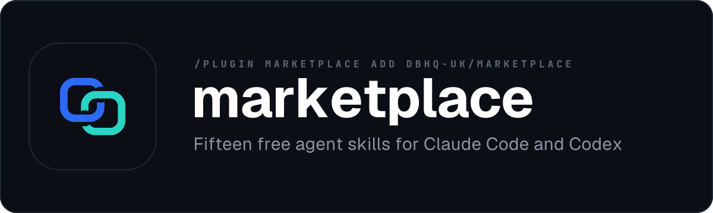

<div align="center">



# DBHQ marketplace

**Free, open-source agent skills for Claude Code and Codex**

[](LICENSE)
[](https://code.claude.com/docs/en/plugin-marketplaces)
[](https://skills.dbhq.uk)

Every one is documented at **[skills.dbhq.uk](https://skills.dbhq.uk)** - including what each deliberately does not do

</div>

---

## Two commands, then you have it

Add the marketplace once:

```
/plugin marketplace add dbhq-uk/marketplace
```

Then install any skill by name:

```
/plugin install <name>@dbhq
```

Both work in [Claude Code](https://code.claude.com/docs/en/plugins) and in
Codex. Every skill also installs without the marketplace - `npx skills add
dbhq-uk/<repo>` through [skills.sh](https://skills.sh), or a clone and
`./install.sh` - and each repository's README carries all three routes.

**Nothing here is a paid tier, a trial, or a thing that phones home.** They are
MIT, they run on your machine, and the ones that talk to a third-party API use
your own credential and say so on their page.

## Plugins

| Plugin | What it does |
|---|---|
| 📬 **[outlook](https://github.com/dbhq-uk/outlook-skill)**<br>`outlook@dbhq` | A pack of Outlook skills - Microsoft 365 email and calendar via the Graph API (inbox, reply-all-safe replies, attachments up to 150 MB, calendar and availability), plus PST and live-mail extraction into integrity-verified markdown archives that stay current |
| 📋 **[trello](https://github.com/dbhq-uk/trello-skill)**<br>`trello@dbhq` | A pack of five Trello skills - trello manages boards, lists and cards, store-sort puts a shopping list in aisle order, board-digest summarises a board, due-radar shows what is due across boards, and life-manager runs a personal board that gets things done |
| 🔎 **[legwork](https://github.com/dbhq-uk/legwork-skill)**<br>`legwork@dbhq` | Decision research where every claim states how well it is supported - a source judged by the claim it backs rather than by its domain, corroboration counted only across genuinely independent sources, and a plain answer when the evidence cannot settle the question |
| 🪵 **[dovetail](https://github.com/dbhq-uk/dovetail-skill)**<br>`dovetail@dbhq` | Checks whether a repository agrees with itself - broken links, dangling anchors, orphaned files, duplicate content and stale translations. Deterministic and fast enough to gate every pull request; never modifies the repo it scans |
| ✒️ **[verve](https://github.com/dbhq-uk/verve-skill)**<br>`verve@dbhq` | Strips AI tells from prose and puts a human voice back, in British English - a catalogue of tells with before/after for each, four tone presets, three strength levels, a two-way politeness check that catches both talking down and going cold, and a scored exit gate where fidelity is a veto rather than an average |
| ⛵ **[vela](https://github.com/dbhq-uk/vela-skill)**<br>`vela@dbhq` | Compiler-exact code search over a SCIP index - where a symbol is defined, every reference, who calls it, and what a change breaks. .NET is indexed natively through Roslyn, so Razor views and Blazor components are included rather than skipped, and any other language reaches the same database through its own SCIP indexer. Nothing stays resident and it never modifies your repo |
| ⌚ **[garmin](https://github.com/dbhq-uk/garmin-skill)**<br>`garmin@dbhq` | Garmin Connect health and fitness data from your agent - Body Battery, HRV, resting heart rate, stress, sleep stages and score, activities, VO2 max, training load, status and readiness. Answers a question live, or writes a day as a markdown snapshot and a week as a rollup you keep; your password is never stored, and it talks to Garmin and nothing else |
| 🖼️ **[imager](https://github.com/dbhq-uk/imager-skill)**<br>`imager@dbhq` | Generate and edit images with OpenAI's GPT Image models, gpt-image-2.5-flare by default - 27 style presets, platform sizing for the places images actually go, transparent backgrounds, masked edits and carousels held together by a reference image. A draft costs around $0.006 against $0.053 for a high-quality final, so you iterate on drafts and pay only for the one you approved |
| 🔦 **[heliograph](https://github.com/dbhq-uk/heliograph)**<br>`heliograph@dbhq` | Debug and change a machine you cannot log into, through an operator who cannot debug it - for air-gapped, client-owned and change-controlled estates. Git carries the step out and the log back, every captured line stamped in UTC so a hang reads as a gap, and the log is pushed whether the run passed or failed |
| 🌳 **[gitview](https://github.com/dbhq-uk/gitview-skill)**<br>`gitview@dbhq` | Surveys every branch and worktree in a repository and says which branches are finished, test-merging to decide it rather than trusting a commit count that a squash-merge makes meaningless, then offers to clear them away - re-verifying each branch immediately before it goes, refusing any that has a worktree or an open pull request, printing both SHAs so a wrong call can be undone, and leasing the remote delete to the commit it checked |
| 🏷️ **[atlassian](https://github.com/dbhq-uk/atlassian-skill)**<br>`atlassian@dbhq` | Jira and Confluence over the REST API, with an API token and no MCP server. Creates, reads and comments on Jira issues - one or a batch, checking the project key, the issue type and the required fields before it writes, so the create call is right the first time - and moves one at a time through its workflow. Searches, reads, creates and updates Confluence pages, and publishes a markdown file to a page. Never deletes, no bulk transition, and the token never reaches a command line |
| 📮 **[pennyblack](https://github.com/dbhq-uk/pennyblack-skill)**<br>`pennyblack@dbhq` | Put a PDF in the post. Printed in the UK and delivered by Royal Mail, with Signed For, Tracked 24/48 and Special Delivery, and the tracking number recorded once Royal Mail issues it. Your PDF is never converted or re-typeset: the provider adds only the address and a small code string, and the preview shows the letter as it will be printed. Every letter is priced and previewed before you commit, and there is deliberately no command that writes and posts in one go |
| 🏗️ **[buildwork](https://github.com/dbhq-uk/buildwork-skill)**<br>`buildwork@dbhq` | Runs a repository's open issues as parallel agents - one per issue, each in its own git worktree and its own pull request - then gates them and proposes a merge order with reasons, checked by trial merges that merge nothing. Refuses to fan out when one agent would do the job, and says why. Never merges and has no merge verb, so every pull request waits for a human to merge it. Under Codex it needs Paseo |
| 🗂️ **[deskwork](https://github.com/dbhq-uk/deskwork-skill)**<br>`deskwork@dbhq` | Files what an agent noticed as a tracked GitHub issue, keeps the dependency graph between issues honest, and writes a roadmap into git carrying the date, the issue count behind it and a line of reasoning per call - so the ordering can be argued with rather than trusted. Never closes an issue and has no close verb |
| 🤝 **[groupwork](https://github.com/dbhq-uk/groupwork-skill)**<br>`groupwork@dbhq` | Blind, independent review by a second model, before something ships. Four patterns, and what makes each one worth citing is what it is refused: red-team attacks an idea without being shown your evidence, second-opinion judges your material without being shown your conclusion, verify rules on finished work against its constraints, panel puts one hard question to two or more agents at once, each answering alone. Codex or opencode behind one provider layer, and every run records what it was told and what it was not |
| 🪧 **[headwork](https://github.com/dbhq-uk/headwork-skill)**<br>`headwork@dbhq` | An even-handed list of options is a decision handed back, so headwork names one as the recommendation, gives the reason, and states what would overturn it - the clause that stops a recommendation becoming an anchor. One question per message and then it waits, for as many rounds as it takes to unblock you. Looks before it asks and says what it checked, so a question a file could have answered is a bug; and refuses to spend a question on something cheap and easily reversed. Never goes hunting for work, never edits anything, and keeps no state |

Each plugin lives in its own repository under
[github.com/dbhq-uk](https://github.com/dbhq-uk), carries its own tests and CI,
and is free to use under the MIT licence. More land here as they are built.

## Why these exist

Every one came out of delivery work rather than from a list of things an agent
could plausibly do, and that shows up in what they refuse. `pennyblack` will
not draft and post a letter in one command, because physical post cannot be
recalled once it is printed. `buildwork` has no merge verb at all. `deskwork`
cannot close an issue. `gitview` never deletes a branch itself. `groupwork`
starts its adversarial pattern in an empty directory, will not run it on Codex
where the sandbox that keeps your repository out cannot start, and records what
each run was withheld at the moment of the run rather than afterwards.

Each page on [skills.dbhq.uk](https://skills.dbhq.uk) states those boundaries
in the skill's own words, because that block is the reason the rest of the page
is worth reading.

## About DBHQ

DBHQ builds and ships AI and cloud engineering, and gives away the small tools
built along the way. [dbhq.uk](https://dbhq.uk)

## License

Marketplace metadata: [MIT](LICENSE) © 2026 DBHQ Consulting Ltd. Each plugin is licensed in its own repository.
